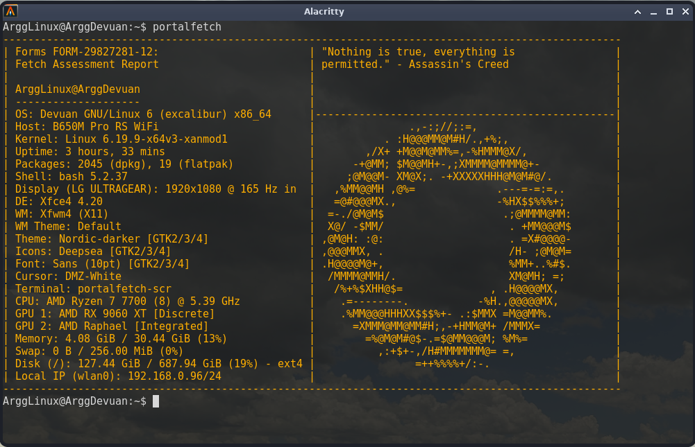
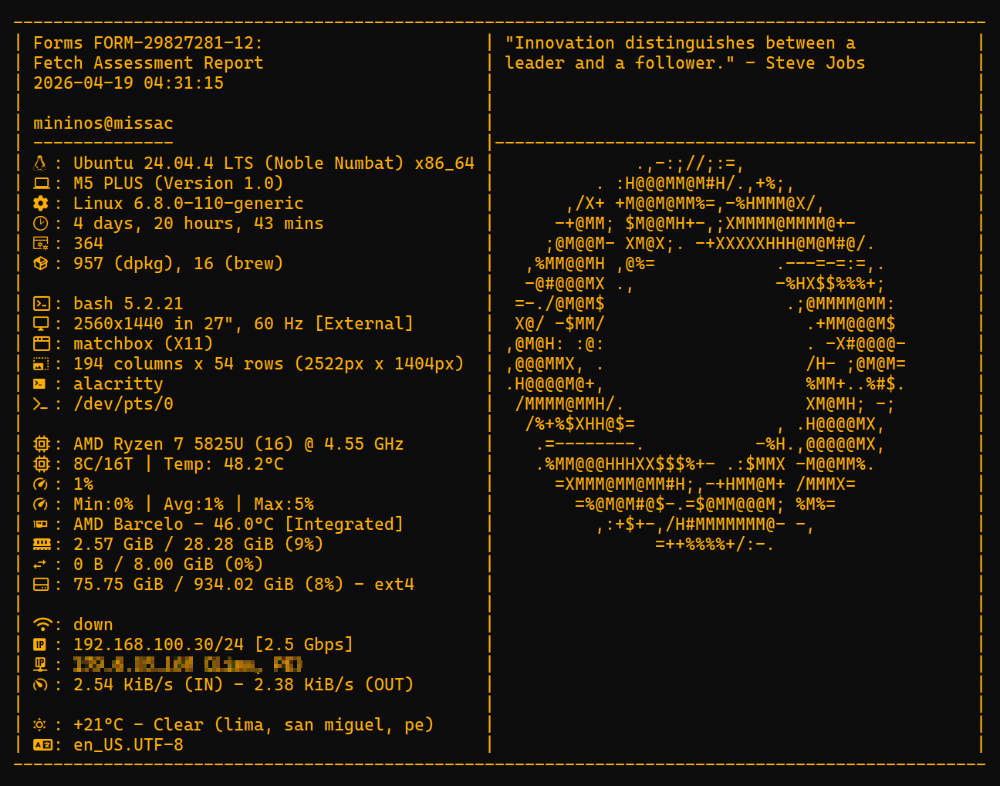

# PortalFetch 🍰

_This is a fork of [Portalfetch by ArgSliver](https://github.com/ArgSliver/portalfetch)_

> _"I'm making a note here: HUGE SUCCESS."_

Portalfetch is a custom bash wrapper for fastfetch that mirrors the Aperture Science terminal from the end credits of Portal 1.

Unlike standard fastfetch configs that break ASCII borders when system information changes length, this calculates and locks the grid in place to make sure it stays in the boxes.



## Compatibility

This wrapper is functional in:

- **Linux:** Fully supported. You may need to install some packages (see [Prerequisites](#prerequisites)).
- **macOS:** Partially supported. You may need to install GNU coreutils (`brew install coreutils`) or update Bash to v4+.
- **Windows:** Not guaranteed. Requires a Bash emulator (such as Git Bash). Modules that depend on `./lib` scripts do not work.

## Features

- **Static Layout:** Replicates the exact dual-pane structure of the Portal end credits.
- **Unbreakable Borders:** Uses a custom rendering script so dynamic data (like changing RAM or Uptime) never misaligns the ASCII walls.
- **Randomized Quotes:** Features a built in database of quotes from classic games (Portal, Half-Life, Halo) and tech figures. Pulls a new quote every time you run it.
- **Powered by Fastfetch:** Fast, lightweight, and uses your existing Fastfetch backend to grab accurate system stats.

### Added in this fork

- **All ASCII art of the credits:** Includes all the ASCII art _Portal 1_ ending. By default, the script randomly selects a logo. You can also pick one manually with `-l` flag. [Credits of the ASCII art.](https://blog.kazitor.com/2014/12/portal-ascii/)
- **Fix `Terminal` field:** fastfetch was detecting the script itself as the terminal. Now the `portalfetch` script reads environment variables and climbs the process tree to identify the current terminal.
- **Show TTY device:** Displays the current TTY device (e.g. `/dev/pts/1`) using the `tty` command, useful for identifying your active session.
- **Responsive Layout:** Generate panel with max size based on the cols and rows of the terminal.
- **Support for NerdFont icons:** Count raw chars and calculate its size to adjust the margins.



## New flags

### `-l|--logo`

You can select a specific logo from the [`./logos`](./logos/) folder, or add your own as `.txt` files in that directory.

To select a logo, use the `-l` or `--logo` flag with the filename (no extension):

```bash
# Example
portalfetch -l cake
```

### `-c|--config`

You can use a preset from fastfetch or a custom config file. This flag is equivalent to the same flag on fastfetch.

```bash
# Example
portalfetch -c all
portalfetch -c path/to/your/config.jsonc
```

### `--all-lines`

Bypass the max_lines limit (terminal height) to print all lines.

### `--`

Send all next arguments/flags direct to fastfetch. Use this flag to use fastfetch flags through portalfetch.

```bash
# Example
portalfetch -- --key-type string
```

## Prerequisites

You must have fastfetch installed on your system before running this.
See: https://github.com/fastfetch-cli/fastfetch on how to install it on your system

You may need to install `jq`, `host`, `curl` if you use the modules in `./lib`

## Installation

Clone the repository and run the install script:

```bash
git clone https://github.com/50512/portalfetch.git
cd portalfetch
chmod +x install.sh
./install.sh
```

## Uninstallation

If you want uninstall portalfetch, run the uninstall script:

```bash
chmod +x uninstall.sh
./uninstall.sh
```
